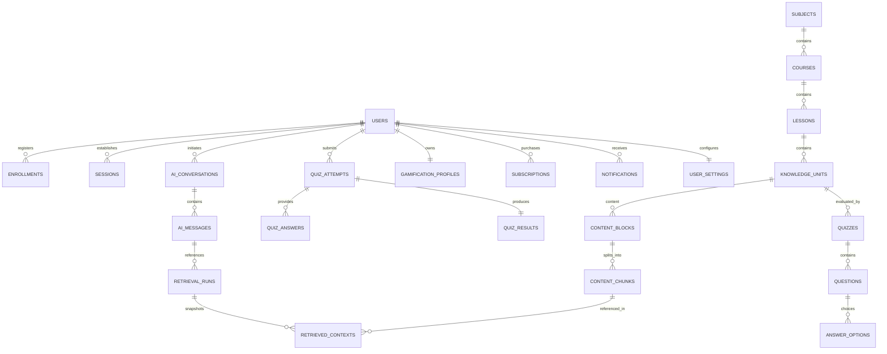

# DB-001 – Core ERD

> **Thông tin quản trị:**
> - **Mã tài liệu:** DB-001
> - **Trạng thái:** Approved
> - **Người sở hữu:** Backend Team
> - **Cập nhật cuối:** 2026-06-28
> - **Tài liệu liên quan:** [PRD-001](file:///d:/ai-learning-platform/docs/prd/PRD-001_First_Learning_Experience.md), [UJ-001](file:///d:/ai-learning-platform/docs/user-journey/UJ-001_First_Learning_Experience.md), [DB-002](file:///d:/ai-learning-platform/docs/database/DB-002_Authentication.md), [DB-011](file:///d:/ai-learning-platform/docs/database/DB-011_System.md)

---

# Mục tiêu

Thiết kế mô hình dữ liệu tổng thể cho AI Learning Platform.

Tài liệu này xác định:

- Các Domain chính.
- Các Entity.
- Quan hệ giữa các Entity.
- Quy tắc thiết kế chung.

DB-001 là nền tảng để xây dựng các tài liệu Database tiếp theo.

---

# Database Domains

- Authentication
- Learning
- AI
- Quiz
- Gamification
- Payment
- System

---

# High-Level ERD

---

# Entity List

## Authentication

- User
- Role
- Permission
- UserRole
- Session
- RefreshToken
- OAuthAccount

## Learning

- Subject
- Course
- Section
- Lesson
- LessonContent
- Enrollment
- LearningPath
- LearningPathCourse
- LessonProgress

## AI

- AIConversation
- AIMessage
- PromptTemplate
- AIUsage
- TokenUsage
- AIModel

## Quiz

- Quiz
- Question
- AnswerOption
- QuizAttempt
- QuizAnswer
- QuizResult

## Gamification

- Badge
- UserBadge
- Achievement
- XPHistory
- DailyStreak

## Payment

- Plan
- Subscription
- Invoice
- Payment
- Coupon

## System

- Notification
- File
- AuditLog
- ActivityLog
- Setting
- UserSetting

---

# Design Rules

## Primary Key

UUID.

## Timestamp

- createdAt
- updatedAt

## Soft Delete

deletedAt

## Audit

- createdBy
- updatedBy

## Status

Enum.

---

# Sprint Output

Sau khi DB-001 được phê duyệt sẽ triển khai:

- DB-002 Authentication
- DB-003 Learning
- DB-004 AI
- DB-005 Quiz
- DB-006 Gamification
- DB-007 Payment
- DB-011 System

Sau đó mới sinh:

- DB-010 RAG
- database.md
- schema.prisma
- migration SQL

