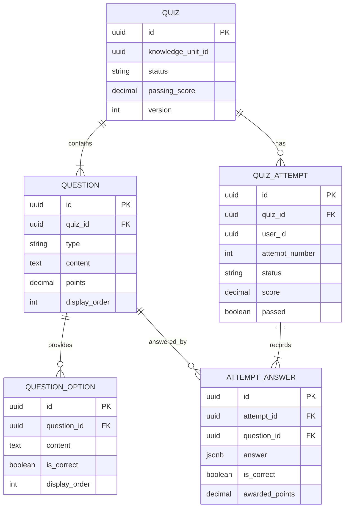

# DB-005 – Quiz Domain

> **Thông tin quản trị:**
> - **Mã tài liệu:** DB-005
> - **Trạng thái:** Approved
> - **Người sở hữu:** Backend Team
> - **Cập nhật cuối:** 2026-06-28
> - **Tài liệu liên quan:** [DB-001](file:///d:/ai-learning-platform/docs/database/DB-001_Core_ERD.md), [API-004](file:///d:/ai-learning-platform/docs/api/API-004_Quiz.md)

---

## 1. Mục tiêu

DB-005 định nghĩa mô hình dữ liệu cho Mini Quiz sau mỗi Knowledge Unit.

Quiz được dùng để:

- Đánh giá mức độ hiểu bài của người học.
- Lưu lịch sử làm bài và từng câu trả lời.
- Cung cấp dữ liệu đầu vào để Learning Domain cập nhật Mastery.
- Hỗ trợ làm lại Quiz mà không ghi đè kết quả cũ.
- Cho phép mở rộng thêm loại câu hỏi trong các sprint sau.

Mini Quiz là công cụ đánh giá quá trình học, không phải bài thi cuối kỳ.

---

## 2. Phạm vi

### Trong phạm vi

- Quiz gắn với Knowledge Unit.
- Ngân hàng câu hỏi và phương án trả lời.
- Phiên làm Quiz của người học.
- Câu trả lời, kết quả chấm điểm và phản hồi.
- Snapshot dữ liệu cần thiết để audit kết quả.
- Sự kiện yêu cầu cập nhật Mastery sau khi nộp bài.

### Ngoài phạm vi

- Nội dung Knowledge Unit: DB-003.
- Công thức và lịch sử Mastery: DB-003.
- Hội thoại và phản hồi AI: DB-004.
- Embedding, semantic search và Vector Store: DB-010 RAG (dự kiến).
- Thi cử có giám sát, chứng chỉ và ngân hàng đề nâng cao.

---

## 3. Nguyên tắc thiết kế

1. Mỗi lần làm Quiz tạo một `QuizAttempt` mới.
2. Kết quả đã nộp là bất biến; không cập nhật hoặc ghi đè.
3. Đáp án của người học được lưu trong `AttemptAnswer`.
4. Dữ liệu chấm điểm quan trọng được snapshot tại thời điểm nộp bài.
5. Quiz Domain không sở hữu Mastery; chỉ phát sinh kết quả đánh giá.
6. Không lưu Embedding hoặc Vector trong `Quiz`, `Question` hay `AttemptAnswer`.
7. Tất cả thời gian lưu theo UTC.
8. Primary key sử dụng UUID.

---

## 4. Domain Overview

```text
KnowledgeUnit (DB-003)
        │
        │ 1:N
        ▼
      Quiz
        │
        │ 1:N
        ▼
     Question
        │
        │ 1:N
        ▼
 QuestionOption

User (DB-002)
        │
        │ 1:N
        ▼
  QuizAttempt
        │
        │ 1:N
        ▼
 AttemptAnswer
```

---

## 5. Entity Summary

| Entity | Vai trò |
| --- | --- |
| `Quiz` | Aggregate root của cấu hình bài Quiz |
| `Question` | Câu hỏi thuộc Quiz |
| `QuestionOption` | Phương án trả lời cho câu hỏi có lựa chọn |
| `QuizAttempt` | Một lần người học thực hiện Quiz |
| `AttemptAnswer` | Câu trả lời và kết quả chấm của từng câu |

---

# 6. Entity: Quiz

## Mục đích

Định nghĩa một bộ câu hỏi đánh giá cho Knowledge Unit.

## Thuộc tính

| Field | Type | Null | Default | Mô tả |
| --- | --- | --- | --- | --- |
| `id` | UUID | ❌ | UUID | Primary key |
| `knowledgeUnitId` | UUID | ❌ | | FK logic → KnowledgeUnit |
| `title` | VARCHAR(255) | ❌ | | Tên Quiz |
| `description` | TEXT | ✅ | | Mô tả ngắn |
| `status` | VARCHAR(20) | ❌ | `DRAFT` | Trạng thái lifecycle |
| `passingScore` | DECIMAL(5,2) | ❌ | `70.00` | Điểm đạt theo thang 0–100 |
| `timeLimitSeconds` | INTEGER | ✅ | | Thời gian tối đa; null là không giới hạn |
| `maxAttempts` | INTEGER | ✅ | | Số lần làm tối đa; null là không giới hạn |
| `shuffleQuestions` | BOOLEAN | ❌ | `TRUE` | Trộn thứ tự câu hỏi |
| `shuffleOptions` | BOOLEAN | ❌ | `TRUE` | Trộn thứ tự lựa chọn |
| `version` | INTEGER | ❌ | `1` | Phiên bản nội dung Quiz |
| `publishedAt` | TIMESTAMPTZ | ✅ | | Thời điểm publish |
| `createdAt` | TIMESTAMPTZ | ❌ | `now()` | Thời điểm tạo |
| `updatedAt` | TIMESTAMPTZ | ❌ | `now()` | Thời điểm cập nhật |

## Trạng thái

```text
DRAFT → PUBLISHED → ARCHIVED
```

## Constraints

- `passingScore` nằm trong khoảng 0–100.
- `timeLimitSeconds > 0` khi có giá trị.
- `maxAttempts > 0` khi có giá trị.
- `version > 0`.
- Chỉ Quiz `PUBLISHED` mới được tạo attempt mới.
- Không sửa câu hỏi của phiên bản đã có attempt; phải tạo phiên bản Quiz mới.

## Index

- `INDEX (knowledgeUnitId, status)`
- `INDEX (status, publishedAt)`
- `UNIQUE (knowledgeUnitId, version)`

---

# 7. Entity: Question

## Mục đích

Lưu nội dung và quy tắc chấm điểm của một câu hỏi.

## Thuộc tính

| Field | Type | Null | Default | Mô tả |
| --- | --- | --- | --- | --- |
| `id` | UUID | ❌ | UUID | Primary key |
| `quizId` | UUID | ❌ | | FK → Quiz |
| `type` | VARCHAR(30) | ❌ | | Loại câu hỏi |
| `content` | TEXT | ❌ | | Nội dung câu hỏi |
| `explanation` | TEXT | ✅ | | Giải thích sau khi chấm |
| `points` | DECIMAL(8,2) | ❌ | `1.00` | Trọng số câu hỏi |
| `displayOrder` | INTEGER | ❌ | | Thứ tự mặc định |
| `answerKey` | JSONB | ✅ | | Đáp án chuẩn cho loại không dùng option |
| `gradingConfig` | JSONB | ✅ | | Cấu hình chấm điểm mở rộng |
| `createdAt` | TIMESTAMPTZ | ❌ | `now()` | Thời điểm tạo |
| `updatedAt` | TIMESTAMPTZ | ❌ | `now()` | Thời điểm cập nhật |

## Question Type

- `SINGLE_CHOICE`
- `MULTIPLE_CHOICE`
- `TRUE_FALSE`
- `MATCHING`
- `FILL_IN_THE_BLANK`
- `SHORT_ANSWER` (giai đoạn sau)

## Constraints

- `content` không được rỗng.
- `points > 0`.
- `displayOrder >= 0` và duy nhất trong cùng Quiz.
- Câu hỏi lựa chọn phải có ít nhất hai `QuestionOption`.
- `answerKey` không chứa dữ liệu nhạy cảm ngoài đáp án cần chấm.

## Index

- `UNIQUE (quizId, displayOrder)`
- `INDEX (quizId, type)`

---

# 8. Entity: QuestionOption

## Mục đích

Lưu các phương án trả lời của câu hỏi có lựa chọn.

## Thuộc tính

| Field | Type | Null | Default | Mô tả |
| --- | --- | --- | --- | --- |
| `id` | UUID | ❌ | UUID | Primary key |
| `questionId` | UUID | ❌ | | FK → Question |
| `content` | TEXT | ❌ | | Nội dung phương án |
| `isCorrect` | BOOLEAN | ❌ | `FALSE` | Phương án đúng |
| `displayOrder` | INTEGER | ❌ | | Thứ tự mặc định |
| `feedback` | TEXT | ✅ | | Phản hồi riêng cho phương án |
| `createdAt` | TIMESTAMPTZ | ❌ | `now()` | Thời điểm tạo |
| `updatedAt` | TIMESTAMPTZ | ❌ | `now()` | Thời điểm cập nhật |

## Constraints

- `content` không được rỗng.
- `displayOrder >= 0` và duy nhất trong cùng Question.
- `SINGLE_CHOICE` và `TRUE_FALSE` chỉ có một option đúng.
- `MULTIPLE_CHOICE` có ít nhất một option đúng.

## Index

- `UNIQUE (questionId, displayOrder)`
- `INDEX (questionId)`

> `isCorrect` chỉ được trả về ở API sau khi attempt đã được nộp và khi chính sách hiển thị đáp án cho phép.

---

# 9. Entity: QuizAttempt

## Mục đích

Đại diện cho một lần người học thực hiện Quiz.

## Thuộc tính

| Field | Type | Null | Default | Mô tả |
| --- | --- | --- | --- | --- |
| `id` | UUID | ❌ | UUID | Primary key |
| `quizId` | UUID | ❌ | | FK → Quiz |
| `userId` | UUID | ❌ | | FK logic → User |
| `attemptNumber` | INTEGER | ❌ | | Lần làm thứ n của User trên Quiz |
| `status` | VARCHAR(20) | ❌ | `IN_PROGRESS` | Trạng thái attempt |
| `quizVersion` | INTEGER | ❌ | | Snapshot phiên bản Quiz |
| `score` | DECIMAL(5,2) | ✅ | | Điểm theo thang 0–100 |
| `earnedPoints` | DECIMAL(10,2) | ✅ | | Tổng điểm đạt được |
| `totalPoints` | DECIMAL(10,2) | ✅ | | Tổng điểm tối đa |
| `correctCount` | INTEGER | ✅ | | Số câu đúng |
| `incorrectCount` | INTEGER | ✅ | | Số câu sai |
| `passed` | BOOLEAN | ✅ | | Có đạt ngưỡng hay không |
| `masteryBefore` | DECIMAL(5,2) | ✅ | | Snapshot Mastery trước khi chấm |
| `masteryAfter` | DECIMAL(5,2) | ✅ | | Mastery do Learning Domain trả về |
| `startedAt` | TIMESTAMPTZ | ❌ | `now()` | Thời điểm bắt đầu |
| `submittedAt` | TIMESTAMPTZ | ✅ | | Thời điểm nộp |
| `gradedAt` | TIMESTAMPTZ | ✅ | | Thời điểm chấm xong |
| `expiresAt` | TIMESTAMPTZ | ✅ | | Thời điểm attempt hết hạn |
| `durationSeconds` | INTEGER | ✅ | | Thời lượng thực tế |
| `gradingVersion` | VARCHAR(50) | ✅ | | Phiên bản thuật toán chấm |
| `createdAt` | TIMESTAMPTZ | ❌ | `now()` | Thời điểm tạo |
| `updatedAt` | TIMESTAMPTZ | ❌ | `now()` | Thời điểm cập nhật |

## Trạng thái

```text
IN_PROGRESS → SUBMITTED → GRADED
      │             │
      ├─────────────┴──→ EXPIRED
      └────────────────→ ABANDONED
```

## Constraints

- `attemptNumber > 0`.
- `score`, `masteryBefore`, `masteryAfter` nằm trong khoảng 0–100 khi có giá trị.
- `earnedPoints`, `totalPoints`, `durationSeconds` không âm.
- Chỉ attempt `IN_PROGRESS` mới được nhận hoặc sửa câu trả lời.
- Một attempt chỉ được submit một lần.
- Attempt `GRADED` phải có `score`, `earnedPoints`, `totalPoints`, `passed` và `gradedAt`.
- Không xóa attempt đã `SUBMITTED` hoặc `GRADED`.

## Index

- `UNIQUE (userId, quizId, attemptNumber)`
- `INDEX (userId, createdAt DESC)`
- `INDEX (quizId, status)`
- `INDEX (userId, quizId, status)`

---

# 10. Entity: AttemptAnswer

## Mục đích

Lưu câu trả lời của người học và kết quả chấm cho từng câu.

## Thuộc tính

| Field | Type | Null | Default | Mô tả |
| --- | --- | --- | --- | --- |
| `id` | UUID | ❌ | UUID | Primary key |
| `attemptId` | UUID | ❌ | | FK → QuizAttempt |
| `questionId` | UUID | ❌ | | FK → Question |
| `answer` | JSONB | ❌ | | Câu trả lời chuẩn hóa |
| `questionSnapshot` | JSONB | ❌ | | Nội dung, type và options tại lúc làm bài |
| `answerKeySnapshot` | JSONB | ✅ | | Đáp án dùng khi chấm, không trả về trước submit |
| `isCorrect` | BOOLEAN | ✅ | | Kết quả đúng/sai |
| `awardedPoints` | DECIMAL(8,2) | ✅ | | Điểm đạt được |
| `maxPoints` | DECIMAL(8,2) | ❌ | | Điểm tối đa snapshot |
| `feedback` | TEXT | ✅ | | Phản hồi sau chấm |
| `answeredAt` | TIMESTAMPTZ | ✅ | | Thời điểm trả lời |
| `gradedAt` | TIMESTAMPTZ | ✅ | | Thời điểm chấm |
| `createdAt` | TIMESTAMPTZ | ❌ | `now()` | Thời điểm tạo |
| `updatedAt` | TIMESTAMPTZ | ❌ | `now()` | Thời điểm cập nhật |

## Ví dụ `answer`

```json
{
  "selectedOptionIds": ["option_uuid"]
}
```

## Constraints

- Mỗi Question chỉ có một `AttemptAnswer` trong cùng Attempt.
- `maxPoints > 0` và `awardedPoints` nằm trong khoảng 0–`maxPoints`.
- `questionSnapshot` là bất biến sau khi tạo.
- Dữ liệu chấm điểm là bất biến sau khi Attempt chuyển sang `GRADED`.

## Index

- `UNIQUE (attemptId, questionId)`
- `INDEX (attemptId)`
- `INDEX (questionId)`

---

# 11. Relationship Matrix

| Source | Target | Quan hệ | Ownership |
| --- | --- | --- | --- |
| KnowledgeUnit | Quiz | 1:N | Learning → Quiz reference |
| Quiz | Question | 1:N | Quiz Domain |
| Question | QuestionOption | 1:N | Quiz Domain |
| User | QuizAttempt | 1:N | Authentication → Quiz reference |
| Quiz | QuizAttempt | 1:N | Quiz Domain |
| QuizAttempt | AttemptAnswer | 1:N | Quiz Domain |
| Question | AttemptAnswer | 1:N | Quiz Domain |

---

# 12. Aggregate và lifecycle

## Quiz Aggregate

```text
Quiz
 └── Question
      └── QuestionOption
```

- `Quiz` là aggregate root.
- Question và QuestionOption không được thay đổi trực tiếp ngoài Quiz aggregate.
- Publish yêu cầu Quiz có từ 3–5 câu hỏi cho Mini Quiz của Sprint 1.

## Attempt Aggregate

```text
QuizAttempt
 └── AttemptAnswer
```

- `QuizAttempt` là aggregate root.
- Submit và grade phải idempotent.
- Client retry cùng idempotency key không được tạo kết quả thứ hai.

---

# 13. Business Rules

## BR-001: Quiz theo Knowledge Unit

- Mỗi Knowledge Unit đã publish phải có ít nhất một Quiz `PUBLISHED` trước khi mở luồng đánh giá.
- Một Knowledge Unit có thể có nhiều phiên bản Quiz nhưng chỉ một phiên bản active tại một thời điểm.

## BR-002: Số lượng câu hỏi

- Mini Quiz Sprint 1 gồm 3–5 câu hỏi.
- Tổng `points` của các câu phải lớn hơn 0.

## BR-003: Làm lại Quiz

- Người học được làm lại khi chưa vượt `maxAttempts`.
- Mỗi lần làm tạo một `QuizAttempt`; không xóa attempt cũ.
- `attemptNumber` tăng tuần tự theo User và Quiz.

## BR-004: Chấm điểm

- Chấm điểm dựa trên snapshot của Question và answer key tại thời điểm attempt.
- `score = earnedPoints / totalPoints × 100`.
- Không dùng dữ liệu câu hỏi đã sửa để chấm lại attempt cũ.

## BR-005: Mastery

- Quiz Domain không cập nhật trực tiếp bảng KnowledgeProgress.
- Sau khi grade thành công, hệ thống phát `QuizAttemptGraded`.
- Learning Domain xử lý sự kiện, cập nhật Mastery và phản hồi `masteryAfter`.
- Consumer phải idempotent theo `attemptId`.

## BR-006: Bảo mật đáp án

- Không trả `isCorrect`, `answerKey` hoặc `answerKeySnapshot` trước khi submit.
- Người dùng chỉ được xem attempt của chính mình, trừ vai trò quản trị được cấp quyền.
- Mọi lần submit và grade phải có audit log.

## BR-007: Tính bất biến

- Attempt đã submit không được quay lại `IN_PROGRESS`.
- Kết quả đã grade không được sửa thủ công; điều chỉnh phải tạo bản ghi audit hoặc regrade có version.

---

# 14. Submission Flow

```text
Client
  │
  ├─ Start Quiz
  ▼
QuizAttempt (IN_PROGRESS)
  │
  ├─ Save AttemptAnswer
  │
  ├─ Submit
  ▼
QuizAttempt (SUBMITTED)
  │
  ├─ Grade from snapshots
  ▼
QuizAttempt (GRADED)
  │
  ├─ Publish QuizAttemptGraded
  ▼
Learning Domain updates Mastery
```

Transaction submit phải khóa attempt hoặc dùng optimistic concurrency để ngăn submit trùng.

---

# 15. Domain Event

## QuizAttemptGraded

```json
{
  "eventId": "uuid",
  "eventType": "QuizAttemptGraded",
  "occurredAt": "2026-06-28T10:00:00Z",
  "attemptId": "uuid",
  "quizId": "uuid",
  "knowledgeUnitId": "uuid",
  "userId": "uuid",
  "score": 80.0,
  "passed": true,
  "correctCount": 4,
  "incorrectCount": 1,
  "gradingVersion": "v1"
}
```

Sự kiện nên được ghi bằng Outbox Pattern trong cùng transaction với kết quả grade.

---

# 16. Database Constraints

## Foreign Key nội bộ

- `Question.quizId → Quiz.id` với `ON DELETE RESTRICT` sau khi publish.
- `QuestionOption.questionId → Question.id` với `ON DELETE CASCADE` khi Quiz còn Draft.
- `QuizAttempt.quizId → Quiz.id` với `ON DELETE RESTRICT`.
- `AttemptAnswer.attemptId → QuizAttempt.id` với `ON DELETE RESTRICT`.
- `AttemptAnswer.questionId → Question.id` với `ON DELETE RESTRICT`.

## Reference liên domain

`knowledgeUnitId` và `userId` là reference ID. Trong Modular Monolith có thể dùng FK vật lý nếu cùng database, nhưng ownership và migration vẫn thuộc domain nguồn.

## Check Constraints

```sql
CHECK (passing_score BETWEEN 0 AND 100)
CHECK (score IS NULL OR score BETWEEN 0 AND 100)
CHECK (mastery_before IS NULL OR mastery_before BETWEEN 0 AND 100)
CHECK (mastery_after IS NULL OR mastery_after BETWEEN 0 AND 100)
CHECK (points > 0)
CHECK (max_points > 0)
CHECK (awarded_points IS NULL OR awarded_points BETWEEN 0 AND max_points)
```

---

# 17. Performance & Index Strategy

Các truy vấn chính:

- Lấy Quiz active theo Knowledge Unit.
- Lấy đầy đủ câu hỏi và options của Quiz.
- Lấy lịch sử attempt theo User.
- Lấy kết quả chi tiết của một attempt.
- Kiểm tra attempt đang làm dở.
- Tổng hợp tỷ lệ đúng theo Question.

Không index trực tiếp toàn bộ JSONB ở Sprint 1. Chỉ thêm GIN index khi có truy vấn thực tế trên `answer` hoặc snapshot và đã đo bằng query plan.

Partition `QuizAttempt` theo thời gian chỉ xem xét khi dữ liệu đủ lớn; không triển khai sớm.

---

# 18. Retention và Audit

- Attempt đã grade được lưu lâu dài để theo dõi tiến bộ.
- Không hard-delete kết quả học tập khi người dùng xóa tài khoản; thực hiện anonymization theo chính sách dữ liệu.
- Snapshot câu hỏi và đáp án giúp tái hiện chính xác kết quả lịch sử.
- Mọi regrade phải lưu `gradingVersion`, lý do và audit record.

---

# 19. AI và RAG Boundary

AI có thể hỗ trợ tạo câu hỏi, giải thích đáp án hoặc phân tích lỗi học tập, nhưng DB-005 chỉ lưu kết quả nghiệp vụ của Quiz.

Không thêm các field sau vào `Question`, `QuizAttempt` hoặc `AttemptAnswer`:

- Embedding vector.
- Vector index metadata.
- Retrieved context.
- Provider-specific vector ID.

Các entity dự kiến của DB-010 RAG:

```text
KnowledgeUnit
      │
      ▼
Embedding
      │
      ▼
VectorStoreIndex

AIConversation
      │
      ▼
RetrievedContext
```

DB-005 chỉ sử dụng reference hoặc domain event nếu về sau cần AI explanation. Việc đổi pgvector, Pinecone, Qdrant hoặc Milvus không được làm thay đổi schema nghiệp vụ của Quiz.

---

# 20. ERD



---

# 21. Sprint 1 Decisions

Sprint 1 triển khai:

- Mini Quiz theo Knowledge Unit.
- 3–5 câu hỏi mỗi Quiz.
- Single Choice, Multiple Choice và True/False.
- Làm lại Quiz.
- Chấm điểm đồng bộ dưới 2 giây.
- Lưu lịch sử và snapshot câu hỏi.
- Phát sự kiện cập nhật Mastery.

Hoãn sang sprint sau:

- Matching, Fill in the Blank và Short Answer.
- AI-generated Quiz production workflow.
- Manual grading.
- Adaptive question selection.
- Offline draft synchronization.
- RAG và semantic retrieval.

---

# 22. Acceptance Checklist

- [ ] Schema hỗ trợ đầy đủ UC-007 và API-004.
- [ ] Quiz published không bị sửa khi đã có attempt.
- [ ] Attempt submit và grade idempotent.
- [ ] Đáp án đúng không bị lộ trước khi submit.
- [ ] Kết quả cũ tái hiện được từ snapshot.
- [ ] Mastery được cập nhật qua integration boundary.
- [ ] Không có Embedding hoặc Vector trong bảng Quiz Domain.
- [ ] Index phục vụ các truy vấn Sprint 1.
- [ ] Migration có rollback plan.
- [ ] Integration test bao phủ retry và submit đồng thời.

---

# 23. Tài liệu tiếp theo

- DB-006 – Gamification Domain.
- DB-007 – Payment Domain.
- DB-010 – RAG / Vector Retrieval Domain (khi có nhu cầu triển khai).

