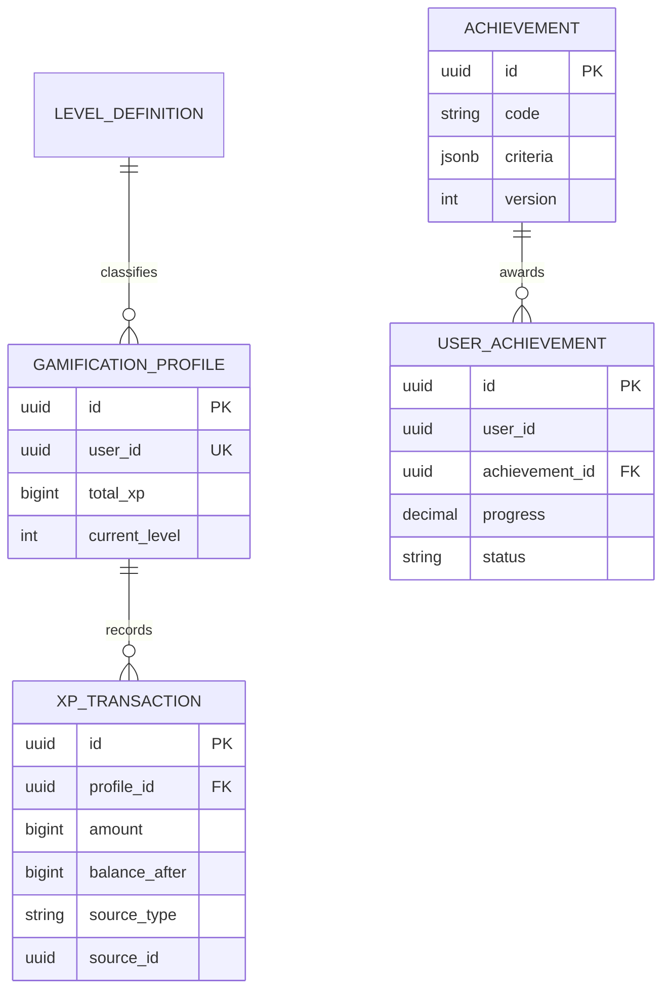

# DB-006 – Gamification Domain

> **Thông tin quản trị:**
> - **Mã tài liệu:** DB-006
> - **Trạng thái:** Approved
> - **Người sở hữu:** Backend Team
> - **Cập nhật cuối:** 2026-06-28
> - **Tài liệu liên quan:** [DB-001](file:///d:/ai-learning-platform/docs/database/DB-001_Core_ERD.md), [API-006](file:///d:/ai-learning-platform/docs/api/API-006_Gamification.md)

---

## 1. Mục tiêu

Thiết kế dữ liệu để ghi nhận XP, Level, Achievement và Streak nhằm khuyến khích người học duy trì tiến độ.

Gamification phản ánh hành vi học tập đã xảy ra; không sở hữu Course, Knowledge Unit, Quiz Result hoặc Mastery.

## 2. Phạm vi

### Trong phạm vi

- Sổ cái XP bất biến.
- Tổng XP và Level hiện tại của người dùng.
- Danh mục Achievement và trạng thái mở khóa.
- Learning Streak theo ngày.
- Rule version dùng khi trao thưởng.

### Ngoài phạm vi

- Mastery và Learning Progress: DB-003.
- Kết quả Quiz: DB-005.
- Thanh toán hoặc quyền truy cập trả phí: DB-007.
- Leaderboard toàn hệ thống: sprint sau.

---

## 3. Entity Summary

| Entity | Vai trò |
| --- | --- |
| `GamificationProfile` | Tổng XP, Level và trạng thái gamification của User |
| `XPTransaction` | Ledger bất biến của mọi thay đổi XP |
| `LevelDefinition` | Cấu hình ngưỡng XP cho từng Level |
| `Achievement` | Định nghĩa thành tích |
| `UserAchievement` | Thành tích User đã đạt hoặc đang tiến triển |
| `LearningStreak` | Chuỗi ngày học liên tục của User |

---

## 4. Entity: GamificationProfile

| Field | Type | Null | Mô tả |
| --- | --- | --- | --- |
| `id` | UUID | ❌ | Primary key |
| `userId` | UUID | ❌ | Reference → User |
| `totalXp` | BIGINT | ❌ | Tổng XP khả dụng, mặc định 0 |
| `currentLevel` | INTEGER | ❌ | Level hiện tại, mặc định 1 |
| `status` | VARCHAR(20) | ❌ | `ACTIVE`, `SUSPENDED` |
| `version` | BIGINT | ❌ | Optimistic concurrency |
| `createdAt` | TIMESTAMPTZ | ❌ | Thời điểm tạo |
| `updatedAt` | TIMESTAMPTZ | ❌ | Thời điểm cập nhật |

### Constraints và Index

- `UNIQUE (userId)`.
- `CHECK (totalXp >= 0)`.
- `CHECK (currentLevel >= 1)`.

---

## 5. Entity: XPTransaction

| Field | Type | Null | Mô tả |
| --- | --- | --- | --- |
| `id` | UUID | ❌ | Primary key |
| `profileId` | UUID | ❌ | FK → GamificationProfile |
| `amount` | BIGINT | ❌ | XP cộng hoặc trừ |
| `balanceAfter` | BIGINT | ❌ | Số dư XP sau giao dịch |
| `reason` | VARCHAR(50) | ❌ | Lý do trao/trừ XP |
| `sourceType` | VARCHAR(50) | ❌ | Loại nguồn nghiệp vụ |
| `sourceId` | UUID | ❌ | ID nguồn như attemptId |
| `ruleVersion` | VARCHAR(30) | ❌ | Phiên bản rule |
| `metadata` | JSONB | ✅ | Metadata không quyết định nghiệp vụ |
| `occurredAt` | TIMESTAMPTZ | ❌ | Thời điểm sự kiện nguồn |
| `createdAt` | TIMESTAMPTZ | ❌ | Thời điểm ghi ledger |

### Constraints và Index

- `amount <> 0` và `balanceAfter >= 0`.
- `UNIQUE (profileId, sourceType, sourceId, reason)` để xử lý idempotent.
- `INDEX (profileId, createdAt DESC)`.
- Transaction đã ghi không được sửa hoặc xóa.

---

## 6. Entity: LevelDefinition

| Field | Type | Null | Mô tả |
| --- | --- | --- | --- |
| `id` | UUID | ❌ | Primary key |
| `level` | INTEGER | ❌ | Số Level |
| `name` | VARCHAR(100) | ❌ | Tên hiển thị |
| `minimumXp` | BIGINT | ❌ | Ngưỡng XP tối thiểu |
| `benefits` | JSONB | ✅ | Mô tả quyền lợi, không thay thế Entitlement |
| `isActive` | BOOLEAN | ❌ | Trạng thái sử dụng |
| `createdAt` | TIMESTAMPTZ | ❌ | Thời điểm tạo |
| `updatedAt` | TIMESTAMPTZ | ❌ | Thời điểm cập nhật |

- `UNIQUE (level)` và `UNIQUE (minimumXp)`.
- `level >= 1`, `minimumXp >= 0`.

---

## 7. Entity: Achievement

| Field | Type | Null | Mô tả |
| --- | --- | --- | --- |
| `id` | UUID | ❌ | Primary key |
| `code` | VARCHAR(80) | ❌ | Mã ổn định |
| `name` | VARCHAR(150) | ❌ | Tên hiển thị |
| `description` | TEXT | ❌ | Mô tả |
| `category` | VARCHAR(40) | ❌ | Nhóm thành tích |
| `criteria` | JSONB | ❌ | Điều kiện có version |
| `xpReward` | BIGINT | ❌ | XP thưởng |
| `status` | VARCHAR(20) | ❌ | `DRAFT`, `ACTIVE`, `RETIRED` |
| `version` | INTEGER | ❌ | Phiên bản rule |
| `createdAt` | TIMESTAMPTZ | ❌ | Thời điểm tạo |
| `updatedAt` | TIMESTAMPTZ | ❌ | Thời điểm cập nhật |

- `UNIQUE (code, version)`.
- `xpReward >= 0`, `version > 0`.

---

## 8. Entity: UserAchievement

| Field | Type | Null | Mô tả |
| --- | --- | --- | --- |
| `id` | UUID | ❌ | Primary key |
| `userId` | UUID | ❌ | Reference → User |
| `achievementId` | UUID | ❌ | FK → Achievement |
| `progress` | DECIMAL(7,4) | ❌ | Tiến độ 0–1 |
| `status` | VARCHAR(20) | ❌ | `IN_PROGRESS`, `UNLOCKED`, `REVOKED` |
| `unlockedAt` | TIMESTAMPTZ | ✅ | Thời điểm mở khóa |
| `sourceEventId` | UUID | ✅ | Event mở khóa |
| `createdAt` | TIMESTAMPTZ | ❌ | Thời điểm tạo |
| `updatedAt` | TIMESTAMPTZ | ❌ | Thời điểm cập nhật |

- `UNIQUE (userId, achievementId)`.
- `CHECK (progress BETWEEN 0 AND 1)`.
- Achievement chỉ trao XP một lần.

---

## 9. Entity: LearningStreak

| Field | Type | Null | Mô tả |
| --- | --- | --- | --- |
| `id` | UUID | ❌ | Primary key |
| `userId` | UUID | ❌ | Reference → User |
| `currentDays` | INTEGER | ❌ | Chuỗi ngày hiện tại |
| `longestDays` | INTEGER | ❌ | Chuỗi ngày dài nhất |
| `lastActivityDate` | DATE | ✅ | Ngày hoạt động theo timezone User |
| `timezone` | VARCHAR(50) | ❌ | IANA timezone |
| `freezeBalance` | INTEGER | ❌ | Số lượt bảo vệ streak |
| `version` | BIGINT | ❌ | Optimistic concurrency |
| `createdAt` | TIMESTAMPTZ | ❌ | Thời điểm tạo |
| `updatedAt` | TIMESTAMPTZ | ❌ | Thời điểm cập nhật |

- `UNIQUE (userId)`.
- Các giá trị số không âm và `longestDays >= currentDays`.
- Một ngày chỉ được tính một lần theo timezone đã snapshot.

---

## 10. Domain Events

Gamification consume:

- `KnowledgeUnitCompleted`.
- `QuizAttemptGraded`.
- `CourseCompleted`.

Gamification publish:

- `XPAwarded`.
- `LevelReached`.
- `AchievementUnlocked`.
- `StreakUpdated`.

Tất cả consumer phải idempotent theo `eventId`; event phát ra dùng Outbox Pattern.

---

## 11. Business Rules

- XP chỉ thay đổi thông qua `XPTransaction`.
- `GamificationProfile.totalXp` là projection có thể rebuild từ ledger.
- Không trao XP lặp lại khi event được retry.
- Level được suy ra từ LevelDefinition, không hard-code trong application.
- Thay đổi rule không được làm thay đổi lịch sử đã trao.
- Suspended profile không nhận thưởng mới nhưng vẫn giữ lịch sử.
- Leaderboard nếu triển khai phải là read model riêng.

---

## 12. ERD

---

## 13. Sprint Scope

Sprint đầu chỉ triển khai XP ledger, Level và Streak cơ bản. Achievement nâng cao, leaderboard và streak freeze có thể bật ở sprint sau.

## 14. Acceptance Checklist

- [ ] Trao XP idempotent.
- [ ] XP ledger bất biến và rebuild được profile.
- [ ] Level không hard-code.
- [ ] Streak xử lý đúng timezone.
- [ ] Không phụ thuộc trực tiếp schema Learning hoặc Quiz.
- [ ] Index hỗ trợ lịch sử XP theo User.

