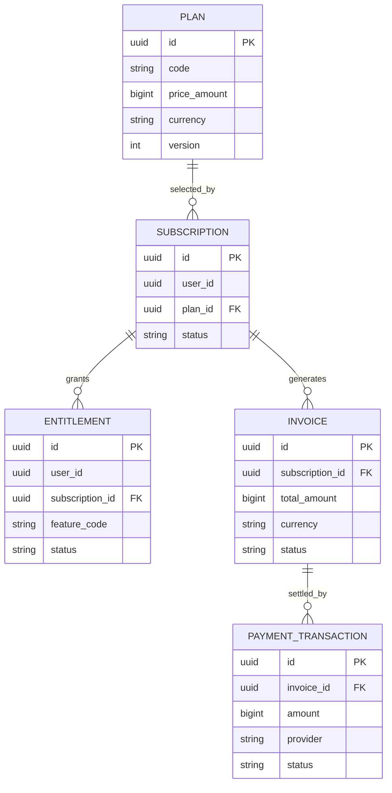

# DB-007 – Payment Domain

> **Thông tin quản trị:**
> - **Mã tài liệu:** DB-007
> - **Trạng thái:** Approved
> - **Người sở hữu:** Backend Team
> - **Cập nhật cuối:** 2026-06-28
> - **Tài liệu liên quan:** [DB-001](file:///d:/ai-learning-platform/docs/database/DB-001_Core_ERD.md), [API-007](file:///d:/ai-learning-platform/docs/api/API-007_Payment.md)

---

## 1. Mục tiêu

Thiết kế dữ liệu cho Plan, Subscription, Entitlement, Invoice và Payment Transaction mà không khóa hệ thống vào một payment provider cụ thể.

## 2. Nguyên tắc

1. Tiền lưu bằng minor unit (`BIGINT`), không dùng floating point.
2. Mọi webhook và thao tác thanh toán phải idempotent.
3. Payment record và invoice đã phát hành là bất biến.
4. Provider ID chỉ tồn tại trong Payment Domain.
5. Quyền truy cập được kiểm tra qua Entitlement, không kiểm tra trực tiếp Payment.
6. Không lưu số thẻ, CVV hoặc dữ liệu PCI nhạy cảm.

---

## 3. Entity Summary

| Entity | Vai trò |
| --- | --- |
| `Plan` | Sản phẩm và chu kỳ giá công khai |
| `Subscription` | Quan hệ đăng ký giữa User và Plan |
| `Entitlement` | Quyền sử dụng feature đã được cấp |
| `Invoice` | Chứng từ yêu cầu thanh toán |
| `PaymentTransaction` | Giao dịch charge/refund từ provider |
| `PaymentWebhook` | Inbox idempotent cho webhook provider |

---

## 4. Entity: Plan

| Field | Type | Null | Mô tả |
| --- | --- | --- | --- |
| `id` | UUID | ❌ | Primary key |
| `code` | VARCHAR(50) | ❌ | Mã ổn định |
| `name` | VARCHAR(120) | ❌ | Tên hiển thị |
| `description` | TEXT | ✅ | Mô tả |
| `billingInterval` | VARCHAR(20) | ❌ | `MONTH`, `YEAR`, `ONE_TIME` |
| `priceAmount` | BIGINT | ❌ | Giá theo minor unit |
| `currency` | CHAR(3) | ❌ | ISO 4217 |
| `features` | JSONB | ❌ | Snapshot feature catalog |
| `status` | VARCHAR(20) | ❌ | `DRAFT`, `ACTIVE`, `RETIRED` |
| `version` | INTEGER | ❌ | Phiên bản giá |
| `createdAt` | TIMESTAMPTZ | ❌ | Thời điểm tạo |
| `updatedAt` | TIMESTAMPTZ | ❌ | Thời điểm cập nhật |

- `UNIQUE (code, version)`.
- `priceAmount >= 0`, `version > 0`.
- Không sửa giá của version đã có subscription.

---

## 5. Entity: Subscription

| Field | Type | Null | Mô tả |
| --- | --- | --- | --- |
| `id` | UUID | ❌ | Primary key |
| `userId` | UUID | ❌ | Reference → User |
| `planId` | UUID | ❌ | FK → Plan |
| `status` | VARCHAR(25) | ❌ | Lifecycle status |
| `provider` | VARCHAR(30) | ✅ | Payment provider |
| `providerCustomerId` | VARCHAR(255) | ✅ | Customer ID ngoài hệ thống |
| `providerSubscriptionId` | VARCHAR(255) | ✅ | Subscription ID ngoài hệ thống |
| `currentPeriodStart` | TIMESTAMPTZ | ✅ | Bắt đầu chu kỳ |
| `currentPeriodEnd` | TIMESTAMPTZ | ✅ | Kết thúc chu kỳ |
| `cancelAtPeriodEnd` | BOOLEAN | ❌ | Mặc định false |
| `canceledAt` | TIMESTAMPTZ | ✅ | Thời điểm hủy |
| `createdAt` | TIMESTAMPTZ | ❌ | Thời điểm tạo |
| `updatedAt` | TIMESTAMPTZ | ❌ | Thời điểm cập nhật |

Lifecycle:

```text
PENDING → TRIALING → ACTIVE → PAST_DUE → CANCELED
                         └──────────────→ EXPIRED
```

- `INDEX (userId, status)`.
- `UNIQUE (provider, providerSubscriptionId)` khi provider ID có giá trị.
- Một User chỉ có một subscription active cho cùng product family.

---

## 6. Entity: Entitlement

| Field | Type | Null | Mô tả |
| --- | --- | --- | --- |
| `id` | UUID | ❌ | Primary key |
| `userId` | UUID | ❌ | Reference → User |
| `subscriptionId` | UUID | ✅ | FK → Subscription |
| `featureCode` | VARCHAR(80) | ❌ | Feature được cấp |
| `status` | VARCHAR(20) | ❌ | `ACTIVE`, `REVOKED`, `EXPIRED` |
| `limitValue` | BIGINT | ✅ | Quota nếu có |
| `validFrom` | TIMESTAMPTZ | ❌ | Bắt đầu hiệu lực |
| `validUntil` | TIMESTAMPTZ | ✅ | Kết thúc hiệu lực |
| `createdAt` | TIMESTAMPTZ | ❌ | Thời điểm tạo |
| `updatedAt` | TIMESTAMPTZ | ❌ | Thời điểm cập nhật |

- `UNIQUE (userId, featureCode, subscriptionId)`.
- Kiểm tra quyền dựa trên status và thời hạn, không dựa trên payment gần nhất.

---

## 7. Entity: Invoice

| Field | Type | Null | Mô tả |
| --- | --- | --- | --- |
| `id` | UUID | ❌ | Primary key |
| `subscriptionId` | UUID | ✅ | FK → Subscription |
| `userId` | UUID | ❌ | Reference → User |
| `number` | VARCHAR(50) | ❌ | Số invoice |
| `status` | VARCHAR(20) | ❌ | `DRAFT`, `OPEN`, `PAID`, `VOID`, `UNCOLLECTIBLE` |
| `subtotalAmount` | BIGINT | ❌ | Tạm tính |
| `discountAmount` | BIGINT | ❌ | Giảm giá |
| `taxAmount` | BIGINT | ❌ | Thuế |
| `totalAmount` | BIGINT | ❌ | Tổng thanh toán |
| `currency` | CHAR(3) | ❌ | ISO 4217 |
| `billingSnapshot` | JSONB | ❌ | Snapshot thông tin xuất hóa đơn |
| `dueAt` | TIMESTAMPTZ | ✅ | Hạn thanh toán |
| `paidAt` | TIMESTAMPTZ | ✅ | Thời điểm thanh toán |
| `createdAt` | TIMESTAMPTZ | ❌ | Thời điểm tạo |

- `UNIQUE (number)`.
- Các amount không âm và `totalAmount = subtotalAmount - discountAmount + taxAmount`.
- Invoice sau khi chuyển `OPEN` không sửa nội dung tài chính.

---

## 8. Entity: PaymentTransaction

| Field | Type | Null | Mô tả |
| --- | --- | --- | --- |
| `id` | UUID | ❌ | Primary key |
| `invoiceId` | UUID | ✅ | FK → Invoice |
| `userId` | UUID | ❌ | Reference → User |
| `type` | VARCHAR(20) | ❌ | `CHARGE`, `REFUND`, `ADJUSTMENT` |
| `status` | VARCHAR(20) | ❌ | `PENDING`, `SUCCEEDED`, `FAILED`, `CANCELED` |
| `amount` | BIGINT | ❌ | Minor unit |
| `currency` | CHAR(3) | ❌ | ISO 4217 |
| `provider` | VARCHAR(30) | ❌ | Provider |
| `providerTransactionId` | VARCHAR(255) | ❌ | ID phía provider |
| `idempotencyKey` | VARCHAR(255) | ❌ | Khóa chống trùng |
| `failureCode` | VARCHAR(80) | ✅ | Mã lỗi chuẩn hóa |
| `failureMessage` | TEXT | ✅ | Mô tả lỗi an toàn |
| `processedAt` | TIMESTAMPTZ | ✅ | Thời điểm hoàn tất |
| `createdAt` | TIMESTAMPTZ | ❌ | Thời điểm tạo |

- `amount > 0`.
- `UNIQUE (provider, providerTransactionId)`.
- `UNIQUE (idempotencyKey)`.
- Transaction thành công không được sửa hoặc xóa.

---

## 9. Entity: PaymentWebhook

| Field | Type | Null | Mô tả |
| --- | --- | --- | --- |
| `id` | UUID | ❌ | Primary key |
| `provider` | VARCHAR(30) | ❌ | Provider |
| `providerEventId` | VARCHAR(255) | ❌ | Event ID provider |
| `eventType` | VARCHAR(100) | ❌ | Loại webhook |
| `payload` | JSONB | ❌ | Payload đã lọc dữ liệu nhạy cảm |
| `status` | VARCHAR(20) | ❌ | `RECEIVED`, `PROCESSED`, `FAILED`, `IGNORED` |
| `attemptCount` | INTEGER | ❌ | Số lần xử lý |
| `receivedAt` | TIMESTAMPTZ | ❌ | Thời điểm nhận |
| `processedAt` | TIMESTAMPTZ | ✅ | Thời điểm xử lý |
| `lastError` | TEXT | ✅ | Lỗi cuối |

- `UNIQUE (provider, providerEventId)`.
- Xác thực chữ ký trước khi persist payload.
- Payload phải có retention policy.

---

## 10. Business Rules

- Subscription state được cập nhật từ event provider đã xác thực.
- Webhook đến sai thứ tự phải xử lý dựa trên event timestamp và state machine.
- `PAST_DUE` có grace period theo policy; không revoke quyền ngay nếu policy chưa yêu cầu.
- Refund tạo transaction mới, không đảo sửa charge cũ.
- Thay Plan giữa chu kỳ phải lưu proration do provider tính và snapshot vào invoice.
- Entitlement projection có thể rebuild từ Subscription và event history.
- Payment failure không được làm mất dữ liệu học tập.

---

## 11. Security và Compliance

- Không lưu PAN, CVV, track data hoặc raw payment method.
- Secret và webhook signing key nằm trong secret manager.
- Mã hóa provider customer ID và billing PII nếu chính sách yêu cầu.
- Audit mọi thao tác refund, cancel và manual adjustment.
- Phân quyền riêng cho billing administrator.
- Thiết lập retention và anonymization phù hợp pháp lý tại thị trường triển khai.

---

## 12. ERD



---

## 13. Acceptance Checklist

- [ ] Amount dùng minor unit và ISO currency.
- [ ] Charge, refund và webhook idempotent.
- [ ] Không lưu dữ liệu thẻ nhạy cảm.
- [ ] Entitlement tách khỏi Payment Transaction.
- [ ] Invoice và transaction có audit trail bất biến.
- [ ] Provider có thể thay thế qua adapter.
- [ ] Webhook retry và out-of-order đã được test.

