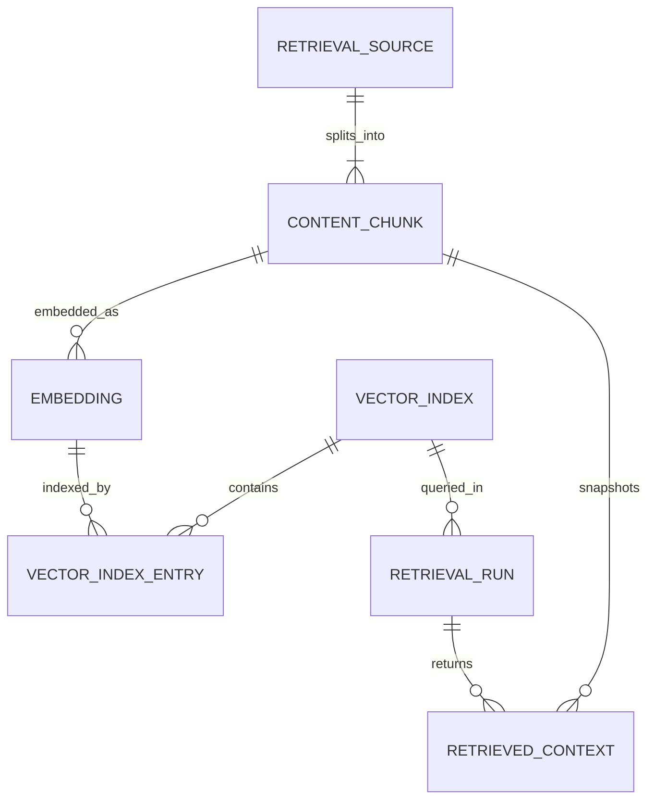

# DB-010 – RAG / Vector Retrieval Domain

## Thông tin

- **Mã:** DB-010
- **Trạng thái:** Approved design; implementation deferred until RAG milestone
- **Domain:** Retrieval
- **Liên quan:** ADR-005, DB-003, DB-004, AI-002

## Mục tiêu

Quản lý source chunk, embedding, vector index và context đã truy xuất mà không đưa vector vào KnowledgeUnit hoặc AIMessage.

## Entity Summary

| Entity | Vai trò |
| --- | --- |
| `RetrievalSource` | Phiên bản nguồn được phép index |
| `ContentChunk` | Đoạn văn chuẩn hóa có provenance |
| `Embedding` | Vector được tạo bởi một model/version |
| `VectorIndex` | Cấu hình logical index độc lập provider |
| `VectorIndexEntry` | Mapping embedding sang provider record |
| `RetrievalRun` | Một lần retrieval cho AI request |
| `RetrievedContext` | Snapshot các chunk được chọn |

## RetrievalSource

| Field | Type | Null | Mô tả |
| --- | --- | --- | --- |
| `id` | UUID | ❌ | Primary key |
| `sourceType` | VARCHAR(50) | ❌ | `CONTENT_BLOCK`, `KNOWLEDGE_UNIT`, `REFERENCE` |
| `sourceId` | UUID | ❌ | ID domain nguồn |
| `sourceVersion` | VARCHAR(50) | ❌ | Phiên bản bất biến |
| `contentHash` | CHAR(64) | ❌ | SHA-256 normalized content |
| `visibility` | VARCHAR(30) | ❌ | Scope truy cập |
| `status` | VARCHAR(20) | ❌ | `PENDING`, `INDEXED`, `STALE`, `REMOVED`, `FAILED` |
| `publishedAt` | TIMESTAMPTZ | ✅ | Thời điểm nguồn publish |
| `createdAt` | TIMESTAMPTZ | ❌ | Thời điểm tạo |
| `updatedAt` | TIMESTAMPTZ | ❌ | Thời điểm cập nhật |

- `UNIQUE (sourceType, sourceId, sourceVersion)`.
- Chỉ nguồn published/approved được index.

## ContentChunk

| Field | Type | Null | Mô tả |
| --- | --- | --- | --- |
| `id` | UUID | ❌ | Primary key |
| `sourceId` | UUID | ❌ | FK → RetrievalSource |
| `sequence` | INTEGER | ❌ | Thứ tự chunk |
| `content` | TEXT | ❌ | Nội dung normalized |
| `tokenCount` | INTEGER | ❌ | Token count theo tokenizer version |
| `startOffset` | INTEGER | ✅ | Vị trí bắt đầu trong nguồn |
| `endOffset` | INTEGER | ✅ | Vị trí kết thúc |
| `metadata` | JSONB | ✅ | Subject/course/language filter metadata |
| `createdAt` | TIMESTAMPTZ | ❌ | Thời điểm tạo |

- `UNIQUE (sourceId, sequence)`.
- Chunk là bất biến; source version mới tạo chunk mới.

## Embedding

| Field | Type | Null | Mô tả |
| --- | --- | --- | --- |
| `id` | UUID | ❌ | Primary key |
| `chunkId` | UUID | ❌ | FK → ContentChunk |
| `model` | VARCHAR(100) | ❌ | Model code |
| `modelVersion` | VARCHAR(100) | ❌ | Model/version provider |
| `dimensions` | INTEGER | ❌ | Số chiều |
| `vectorPayload` | VECTOR/BYTEA/NULL | ✅ | Chỉ dùng nếu adapter lưu local |
| `contentHash` | CHAR(64) | ❌ | Hash nội dung đã embed |
| `status` | VARCHAR(20) | ❌ | `PENDING`, `READY`, `FAILED` |
| `createdAt` | TIMESTAMPTZ | ❌ | Thời điểm tạo |

- `UNIQUE (chunkId, model, modelVersion)`.
- `dimensions > 0`.
- Provider external có thể không lưu `vectorPayload` trong PostgreSQL.

## VectorIndex

| Field | Type | Null | Mô tả |
| --- | --- | --- | --- |
| `id` | UUID | ❌ | Primary key |
| `code` | VARCHAR(80) | ❌ | Logical index code |
| `provider` | VARCHAR(30) | ❌ | Adapter provider |
| `providerIndexName` | VARCHAR(255) | ❌ | Tên index phía provider |
| `embeddingModel` | VARCHAR(100) | ❌ | Model tương thích |
| `dimensions` | INTEGER | ❌ | Số chiều |
| `distanceMetric` | VARCHAR(20) | ❌ | `COSINE`, `DOT`, `EUCLIDEAN` |
| `configuration` | JSONB | ❌ | Cấu hình không chứa secret |
| `status` | VARCHAR(20) | ❌ | `BUILDING`, `ACTIVE`, `RETIRED`, `FAILED` |
| `createdAt` | TIMESTAMPTZ | ❌ | Thời điểm tạo |
| `updatedAt` | TIMESTAMPTZ | ❌ | Thời điểm cập nhật |

- `UNIQUE (code)` và `UNIQUE (provider, providerIndexName)`.
- Secret/provider credential không lưu trong bảng.

## VectorIndexEntry

| Field | Type | Null | Mô tả |
| --- | --- | --- | --- |
| `id` | UUID | ❌ | Primary key |
| `indexId` | UUID | ❌ | FK → VectorIndex |
| `embeddingId` | UUID | ❌ | FK → Embedding |
| `providerRecordId` | VARCHAR(255) | ❌ | ID record phía provider |
| `status` | VARCHAR(20) | ❌ | `PENDING`, `INDEXED`, `DELETED`, `FAILED` |
| `indexedAt` | TIMESTAMPTZ | ✅ | Thời điểm upsert thành công |
| `lastError` | TEXT | ✅ | Lỗi an toàn cuối cùng |

- `UNIQUE (indexId, embeddingId)`.
- `UNIQUE (indexId, providerRecordId)`.

## RetrievalRun

| Field | Type | Null | Mô tả |
| --- | --- | --- | --- |
| `id` | UUID | ❌ | Primary key |
| `aiRequestId` | UUID | ❌ | Reference → AI request/usage |
| `conversationId` | UUID | ✅ | Reference → AIConversation |
| `queryHash` | CHAR(64) | ❌ | Hash query đã chuẩn hóa |
| `queryText` | TEXT | ✅ | Chỉ lưu nếu privacy policy cho phép |
| `strategy` | VARCHAR(50) | ❌ | Semantic/hybrid strategy version |
| `indexId` | UUID | ❌ | FK → VectorIndex |
| `topK` | INTEGER | ❌ | Số candidate |
| `latencyMs` | INTEGER | ❌ | Retrieval latency |
| `status` | VARCHAR(20) | ❌ | `SUCCEEDED`, `NO_RESULT`, `FAILED` |
| `createdAt` | TIMESTAMPTZ | ❌ | Thời điểm tạo |

- `UNIQUE (aiRequestId)`.
- `topK > 0`, `latencyMs >= 0`.

## RetrievedContext

| Field | Type | Null | Mô tả |
| --- | --- | --- | --- |
| `id` | UUID | ❌ | Primary key |
| `retrievalRunId` | UUID | ❌ | FK → RetrievalRun |
| `chunkId` | UUID | ❌ | FK → ContentChunk |
| `rank` | INTEGER | ❌ | Thứ hạng cuối |
| `retrievalScore` | DECIMAL(10,8) | ✅ | Score provider |
| `rerankScore` | DECIMAL(10,8) | ✅ | Score reranker |
| `selected` | BOOLEAN | ❌ | Có đưa vào prompt hay không |
| `contentSnapshot` | TEXT | ❌ | Nội dung dùng tại thời điểm trả lời |
| `sourceSnapshot` | JSONB | ❌ | Provenance/version/citation snapshot |
| `createdAt` | TIMESTAMPTZ | ❌ | Thời điểm tạo |

- `UNIQUE (retrievalRunId, rank)`.
- Snapshot bất biến theo retention policy.

## Lifecycle

```text
Source Published
  → Chunked
  → Embedded
  → Indexed
  → Retrieved
  → Context Snapshot
```

Source update tạo version mới. Index mới active trước khi retire index cũ để zero-downtime reindex.

## Business Rules

- Không index draft/unpublished content.
- Authorization filter phải áp dụng trước khi trả context.
- Re-embedding không sửa embedding cũ; tạo model version mới.
- AIMessage không chứa vector, chỉ có thể reference RetrievalRun.
- RetrievedContext phải đủ provenance để audit citation.
- Xóa/unpublish source phải làm entry không còn searchable.
- Provider retry idempotent theo index + embedding.

## Indexes

- `RetrievalSource(status, sourceType, sourceId)`.
- `ContentChunk(sourceId, sequence)`.
- `Embedding(status, model, modelVersion)`.
- `VectorIndexEntry(indexId, status)`.
- `RetrievalRun(conversationId, createdAt DESC)`.
- `RetrievedContext(retrievalRunId, rank)`.

Vector-native index do adapter/provider quản lý, không được giả định trong domain schema.

## ERD



## Acceptance Checklist

- [ ] Learning và AIMessage không chứa vector.
- [ ] Source/chunk/model đều có version và hash.
- [ ] Có thể chạy song song index cũ và mới.
- [ ] Retrieval có authorization filter.
- [ ] Citation audit được từ snapshot.
- [ ] Provider adapter thay được mà không đổi domain consumer.
- [ ] Delete/unpublish loại source khỏi kết quả mới.

