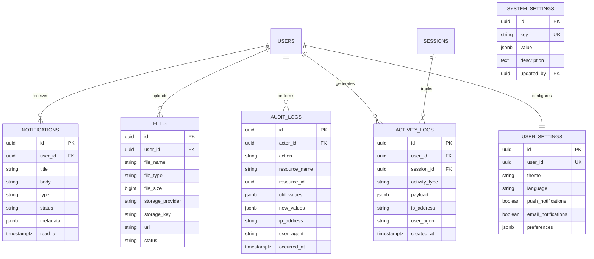

# DB-011 – System Domain

## Thông tin

- **Mã:** DB-011
- **Trạng thái:** Draft
- **Domain:** System
- **Liên quan:** DB-001, DB-002, DB-008

---

## 1. Mục tiêu

Thiết kế mô hình dữ liệu cho các chức năng hỗ trợ hệ thống (Cross-cutting / System support) bao gồm:
- **Notification**: Quản lý thông tin và trạng thái gửi thông báo tới người học.
- **File**: Quản lý metadata và khóa lưu trữ của các tệp đa phương tiện tải lên Object Storage.
- **AuditLog**: Ghi nhận lịch sử các hành động quản trị nhạy cảm nhằm phục vụ kiểm toán và bảo mật.
- **ActivityLog**: Thu thập log hành động của người dùng (bao gồm Guest và Registered User) phục vụ telemetry, gỡ lỗi và phân tích hành vi.
- **Setting**: Cấu hình hệ thống động dạng key-value.
- **UserSetting**: Lưu cấu hình cá nhân hóa của từng người dùng.

---

## 2. Phạm vi

### Trong phạm vi
- Thiết kế các bảng lưu trữ thông báo và trạng thái đọc/chưa đọc.
- Bảng quản lý metadata của tệp tin tải lên (không lưu trữ nhị phân trực tiếp trong PostgreSQL).
- Bảng ghi chép hành động bất biến của admin/moderator (`AuditLog`).
- Bảng ghi nhận hành vi sử dụng của client (`ActivityLog`).
- Cơ chế quản lý cấu hình hệ thống và tùy chọn người dùng.

### Ngoài phạm vi
- Lưu trữ nhị phân thực tế của File (nằm trên S3 / MinIO).
- Log ứng dụng của web server (nằm trên ELK / Loki / CloudWatch).
- Leaderboard hoặc các projection phức tạp của Gamification (DB-006).

---

## 3. Entity Summary

| Bảng vật lý | Entity | Vai trò |
| --- | --- | --- |
| `notifications` | `Notification` | Quản lý thông báo cá nhân hoặc hệ thống gửi tới người dùng |
| `files` | `SystemFile` | Quản lý metadata của file upload trên Object Storage |
| `audit_logs` | `AuditLog` | Nhật ký ghi nhận các thay đổi nghiệp vụ của quản trị viên (bất biến) |
| `activity_logs` | `ActivityLog` | Nhật ký hành vi người dùng trên các ứng dụng client |
| `system_settings` | `SystemSetting` | Cấu hình tham số động cho toàn hệ thống |
| `user_settings` | `UserSetting` | Cấu hình tùy chọn cá nhân của từng người dùng |

---

## 4. Entity: Notification (`notifications`)

### Schema thiết kế
| Column | Type | Null | Mô tả |
| --- | --- | --- | --- |
| `id` | UUID | ❌ | Primary key |
| `user_id` | UUID | ✅ | Reference → `users(id)`. NULL nếu là thông báo hệ thống gửi chung cho mọi người |
| `title` | VARCHAR(255) | ❌ | Tiêu đề thông báo |
| `body` | TEXT | ❌ | Nội dung thông báo |
| `type` | VARCHAR(50) | ❌ | Phân loại: `SYSTEM`, `ACHIEVEMENT`, `LEARNING_PATH`, `REMINDER` |
| `status` | VARCHAR(20) | ❌ | Trạng thái: `UNREAD`, `READ`, `ARCHIVED` |
| `metadata` | JSONB | ✅ | Dữ liệu bổ sung (như deep link, ID sự kiện liên quan) |
| `read_at` | TIMESTAMPTZ | ✅ | Thời điểm người dùng đọc thông báo |
| `created_at` | TIMESTAMPTZ | ❌ | Thời điểm tạo thông báo |
| `updated_at` | TIMESTAMPTZ | ❌ | Thời điểm cập nhật |

### Constraints và Index
- `CHECK (status IN ('UNREAD', 'READ', 'ARCHIVED'))`.
- `INDEX idx_notifications_user_status (user_id, status)`.
- `INDEX idx_notifications_created_at (created_at DESC)`.

---

## 5. Entity: SystemFile (`files`)

### Schema thiết kế
| Column | Type | Null | Mô tả |
| --- | --- | --- | --- |
| `id` | UUID | ❌ | Primary key |
| `user_id` | UUID | ✅ | Reference → `users(id)`. Người upload file (NULL nếu hệ thống tự tạo) |
| `file_name` | VARCHAR(255) | ❌ | Tên file gốc do người dùng đặt |
| `file_type` | VARCHAR(100) | ❌ | Mime-type của file (ví dụ: `image/png`, `video/mp4`) |
| `file_size` | BIGINT | ❌ | Kích thước file tính bằng byte |
| `storage_provider` | VARCHAR(30) | ❌ | Provider lưu trữ: `S3`, `MINIO`, `LOCAL` |
| `storage_key` | VARCHAR(512) | ❌ | Đường dẫn tương đối lưu trữ vật lý trong bucket |
| `url` | VARCHAR(1024) | ✅ | URL truy cập trực tiếp (hoặc thông qua CDN) nếu là public file |
| `status` | VARCHAR(20) | ❌ | Trạng thái: `PENDING`, `ACTIVE`, `DELETED` |
| `created_at` | TIMESTAMPTZ | ❌ | Thời điểm upload |
| `updated_at` | TIMESTAMPTZ | ❌ | Thời điểm cập nhật |

### Constraints và Index
- `CHECK (file_size > 0)`.
- `CHECK (status IN ('PENDING', 'ACTIVE', 'DELETED'))`.
- `UNIQUE (storage_provider, storage_key)` tránh ghi đè file trên storage.
- `INDEX idx_files_user (user_id)`.

---

## 6. Entity: AuditLog (`audit_logs`)

### Schema thiết kế
| Column | Type | Null | Mô tả |
| --- | --- | --- | --- |
| `id` | UUID | ❌ | Primary key |
| `actor_id` | UUID | ❌ | Reference → `users(id)`. Admin hoặc Moderator thực hiện hành động |
| `action` | VARCHAR(100) | ❌ | Hành động (ví dụ: `USER_SUSPENDED`, `COURSE_PUBLISHED`, `PLAN_UPDATED`) |
| `resource_name` | VARCHAR(50) | ❌ | Tên bảng/đối tượng bị tác động (ví dụ: `User`, `Course`, `Plan`) |
| `resource_id` | UUID | ❌ | ID cụ thể của đối tượng bị tác động |
| `old_values` | JSONB | ✅ | Trạng thái cũ trước khi thay đổi |
| `new_values` | JSONB | ✅ | Trạng thái mới sau khi thay đổi |
| `ip_address` | VARCHAR(45) | ✅ | Địa chỉ IP của người dùng thực hiện (hỗ trợ IPv6) |
| `user_agent` | VARCHAR(512) | ✅ | Thông tin trình duyệt/app client |
| `occurred_at` | TIMESTAMPTZ | ❌ | Thời điểm hành động xảy ra thực tế |

### Constraints và Index
- Bảng này là **bất biến (insert-only)**. Không có trigger cập nhật hoặc soft delete.
- `INDEX idx_audit_resource (resource_name, resource_id)`.
- `INDEX idx_audit_occurred_at (occurred_at DESC)`.

---

## 7. Entity: ActivityLog (`activity_logs`)

### Schema thiết kế
| Column | Type | Null | Mô tả |
| --- | --- | --- | --- |
| `id` | UUID | ❌ | Primary key |
| `user_id` | UUID | ✅ | Reference → `users(id)`. Có thể NULL đối với Guest chưa xác định |
| `session_id` | UUID | ✅ | Reference → `sessions(id)`. Liên kết với phiên của người dùng |
| `activity_type` | VARCHAR(100) | ❌ | Loại hoạt động (ví dụ: `PAGE_VIEW`, `BUTTON_CLICK`, `APP_CRASH`) |
| `payload` | JSONB | ✅ | Chi tiết sự kiện (ví dụ: tên màn hình, tọa độ click, stack trace lỗi) |
| `ip_address` | VARCHAR(45) | ✅ | Địa chỉ IP thiết bị |
| `user_agent` | VARCHAR(512) | ✅ | Thông tin thiết bị / OS / Browser |
| `created_at` | TIMESTAMPTZ | ❌ | Thời điểm sự kiện được ghi nhận |

### Constraints và Index
- Bảng này là **bất biến (insert-only)** và có chính sách tự động xóa (partition/archive) sau 30-90 ngày tùy quy định.
- `INDEX idx_activity_user_created (user_id, created_at DESC)`.
- `INDEX idx_activity_session (session_id)`.

---

## 8. Entity: SystemSetting (`system_settings`)

### Schema thiết kế
| Column | Type | Null | Mô tả |
| --- | --- | --- | --- |
| `id` | UUID | ❌ | Primary key |
| `key` | VARCHAR(100) | ❌ | Khóa định danh duy nhất (ví dụ: `system.maintenance_mode`, `ai.default_model`) |
| `value` | JSONB | ❌ | Giá trị cấu hình |
| `description` | TEXT | ✅ | Mô tả vai trò của cấu hình này |
| `updated_by` | UUID | ✅ | Reference → `users(id)`. Admin cập nhật lần cuối |
| `created_at` | TIMESTAMPTZ | ❌ | Thời điểm tạo cấu hình |
| `updated_at` | TIMESTAMPTZ | ❌ | Thời điểm cập nhật cấu hình |

### Constraints và Index
- `UNIQUE (key)`.

---

## 9. Entity: UserSetting (`user_settings`)

### Schema thiết kế
| Column | Type | Null | Mô tả |
| --- | --- | --- | --- |
| `id` | UUID | ❌ | Primary key |
| `user_id` | UUID | ❌ | Reference → `users(id)` |
| `theme` | VARCHAR(20) | ❌ | Chủ đề: `DARK`, `LIGHT`, `SYSTEM` |
| `language` | VARCHAR(10) | ❌ | Mã ngôn ngữ (ví dụ: `vi`, `en`) |
| `push_notifications` | BOOLEAN | ❌ | Cho phép nhận push notification hay không |
| `email_notifications` | BOOLEAN | ❌ | Cho phép nhận email thông báo hay không |
| `preferences` | JSONB | ✅ | Các tùy chỉnh nâng cao khác của người dùng |
| `created_at` | TIMESTAMPTZ | ❌ | Thời điểm tạo |
| `updated_at` | TIMESTAMPTZ | ❌ | Thời điểm cập nhật |

### Constraints và Index
- `UNIQUE (user_id)`.
- `CHECK (theme IN ('DARK', 'LIGHT', 'SYSTEM'))`.

---

## 10. Business Rules

- **Bất biến đối với log**: Cả `audit_logs` và `activity_logs` đều không được phép UPDATE hoặc DELETE bởi ứng dụng runtime.
- **Ranh giới File upload**: Khi một tệp tin vật lý được tải lên storage thành công, `SystemFile` sẽ ở trạng thái `ACTIVE`. Nếu tệp tin không được liên kết với bất kỳ thực thể nghiệp vụ nào (như avatar hoặc nội dung bài học) sau 24h, một worker định kỳ sẽ chuyển nó sang `DELETED` và xóa vật lý trên storage.
- **Quyền riêng tư đối với ActivityLog**: Thông tin nhạy cảm của người dùng (như mật khẩu, token, hoặc text chat chi tiết không được cấu hình trước) **không** được đưa vào trường `payload` của `activity_logs`.
- **System Settings Cache**: Để tối ưu hiệu năng, cấu hình `system_settings` sẽ được cache lại trên Redis. Khi một bản ghi trong `system_settings` được thay đổi bởi Admin, một sự kiện `SystemSettingUpdated` sẽ được phát ra để cập nhật Redis cache.

---

## 11. ERD

---

## 12. Acceptance Checklist

- [ ] `audit_logs` và `activity_logs` được thiết kế chỉ-thêm (insert-only).
- [ ] Khóa ngoại `user_id` trong `notifications` và `activity_logs` cho phép nullable phục vụ thông báo hệ thống và guest telemetry.
- [ ] Object storage URL và metadata được lưu trong `files`, tách biệt với file vật lý.
- [ ] Cache policy cho `system_settings` được định nghĩa rõ ràng.
- [ ] Bảo vệ quyền riêng tư người dùng thông qua quy tắc PII cho ActivityLog payload.
